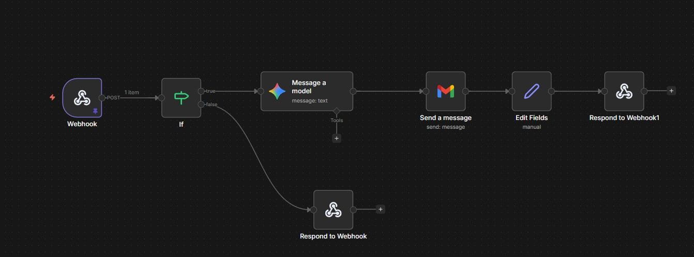

# 📄 AI Document Orchestrator

An end-to-end AI-powered system that extracts insights from documents and triggers automated actions based on business rules.

---

## 🚀 Live Demo

👉 https://ai-document-orchestrator-qvmykmfebxrughfvmyea34.streamlit.app/

---

## 🧠 Overview

This project demonstrates how to combine:

* **AI (Gemini)** for intelligent document understanding
* **Streamlit** for interactive UI
* **n8n** for workflow automation

👉 Result: A system that converts **unstructured documents → structured insights → automated decisions**

---

## 🔄 n8n Workflow

<p align="center">
  
  <br/>
  <em>Automated workflow handling risk detection and email alerts</em>
</p>

---

## ⚙️ Features

* 📂 Upload PDF/TXT documents
* ❓ Ask natural language questions about the document
* 📊 Dynamic structured data extraction using AI
* ⚠️ Risk detection based on invoice amount
* 📧 Automated email alerts (via n8n)
* 🔄 Real-time response displayed in UI

---

## 🧪 How to Use

1. Upload a document (invoice recommended)
2. Ask a question

   * Example: *"What is this invoice about?"*
   * Example: *"Is this invoice risky?"*
3. View extracted structured data
4. Enter recipient email
5. Click **Send Alert Mail**

---

## ⚠️ Business Logic (Risk Detection)

* If **invoice amount > 50,000** → **High Risk**
* Otherwise → **Normal**

👉 High-risk invoices trigger an alert email

---

## 📧 Email Automation

* Triggered manually by user
* Sends detailed alert including:

  * Invoice summary
  * Amount
  * Reason for risk

---

## 🔄 System Architecture
```
User Input (Streamlit UI)
↓
Text Extraction (PDF/TXT)
↓
Gemini API (Structured Data Extraction)
↓
User Trigger (Send Email)
↓
n8n Webhook
↓
IF Condition (Risk Check)
↓ ↓
TRUE FALSE
↓ ↓
Email Sent No Action
↓
Response to Streamlit UI
```

---

## 🛠️ Tech Stack

* **Frontend:** Streamlit
* **Backend:** Python
* **AI Model:** Gemini API
* **Automation:** n8n
* **Libraries:** pdfplumber, PyMuPDF, requests

---

## 🔐 Security

* API keys stored securely using `.streamlit/secrets.toml`
* No hardcoded credentials

---

## 💡 Use Cases

* Invoice risk monitoring
* Financial anomaly detection
* Business process automation
* Compliance workflows

---

## 🎯 Key Learning

* Handling unstructured data with AI
* Integrating AI into real-world workflows
* Building end-to-end automation systems

---

## 📌 Future Improvements

* Support more document types
* Add multiple risk rules
* Dashboard for tracking alerts
* Multi-user support

---

## 🙌 Author

**Madan Dahiphale**  
[LinkedIn](https://www.linkedin.com/in/madandahiphale)

---

## ⭐ If you like this project

Give it a ⭐ on GitHub!
